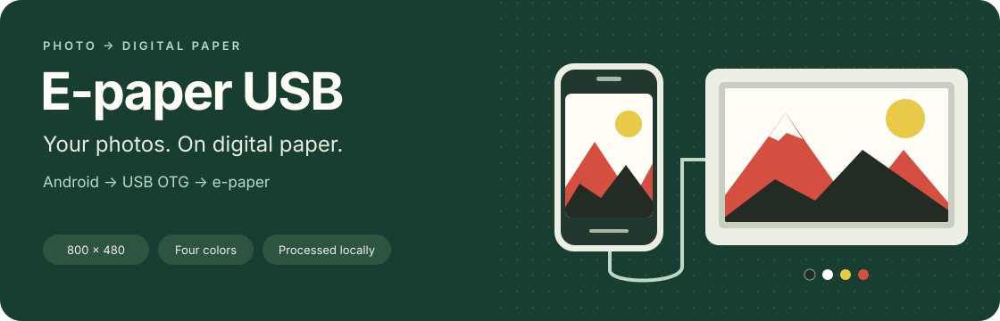

<p align="center">
  
</p>

# E-paper USB

**Turn a photo on your Android phone into an image for your e-paper display.** Choose a photo, adjust the preview, and send it directly over a USB OTG cable. Designed as an Android alternative to the Windows ImageToUSB workflow, with a separate local browser app for desktop use.

**[Get started](#get-started)** · **[Example hardware](#example-hardware)** · **[Build the app](#build-the-app)** · **[Language summaries](#language-summaries)** · **[Test results](docs/validation.md)**

## What it does

- **Prepare your photo:** select an image, rotate it, and choose a proportional crop or white borders.
- **Preview four colors:** convert to black, white, yellow and red at **800 × 480**, with optional dithering. The preview and transmitted data use the same final image.
- **Send by cable:** connect a CH340-based controller through USB OTG, grant USB access, and tap **Send**. Connecting alone never starts a transfer.
- **Keep photos local:** Android processes images on the phone and has no internet permission. Diagnostic logs can be exported locally.
- **Use your language:** the Android app follows device language settings, with **12 locale variants** and English fallback. Android 13+ also offers per-app language settings.

| Android app | Desktop browser app |
| --- | --- |
| Android 8.0+ with USB host / OTG | Local app served with Node.js 20+ |
| Direct USB transfer from the phone | USB transfer in desktop Chrome or Edge |
| Photo picker, preview, four-color conversion | Image conversion, PNG/C export, serial upload |
| Multilingual interface | English interface |

## Example hardware

**[Good Display GDP075FU1 — view the manufacturer's product page](https://www.good-display.com/product/640.html)**

The app's target profile is based on the **GDP075FU1 USB model** and the ImageToUSB v4.0 protocol. Good Display lists this model with a **7.5-inch, 800 × 480 display**, **black / white / red / yellow** colors, and a **Micro USB connection**. The linked page also includes the GDP075FW1 and GDP075FW1B Wi-Fi models; this project's USB profile targets GDP075FU1. [Manufacturer specifications](https://www.good-display.com/product/640.html)

> **Compatibility status:** CH340 detection and serial-port opening have been verified on a Pixel 10. A complete image transfer and physical screen refresh still need hardware validation. Check the controller and panel model; a CH340 identifier alone does not establish compatibility. [See validation details](docs/validation.md).

## Get started

1. Build and install the Android app using the instructions below.
2. Connect the display to your phone with a suitable **USB OTG adapter and data cable**.
3. Open **E-paper USB**, tap **Connect USB**, and allow access when Android asks.
4. Select a photo or **Color test**, adjust the preview, and tap **Send to display**. Keep the app open and the display connected.

**Send becomes available when both an image and an authorized USB connection are ready.** After a failed or interrupted transfer, power the display off and on before retrying. A completed send confirms bytes were written; check the physical display to confirm the result.

## Build the app

Open [`android/`](android/) in Android Studio and configure the SDK. On macOS, from the repository root:

```sh
android/tools/build-macos.sh
```

The script runs Android tests, Lint, and the debug build. Install the generated APK at `android/app/build/outputs/apk/debug/app-debug.apk`. Build dependencies require internet; the installed Android app works locally. See the [Android guide](android/README.md) for SDK requirements, installation, and the physical test procedure.

To run the separate **desktop browser app**:

```sh
npm start
```

Open **http://localhost:5173** in desktop Chrome or Edge. No npm dependencies are required. See the [browser guide](docs/browser.md) for profiles, exports and serial upload.

## Language summaries

The following summaries cover every language variant supported by the **Android app**. Expand a language to read a short overview and find the example product.

<details>
<summary><strong>English</strong></summary>

Select a photo on your Android phone, crop or rotate it, preview it in four colors, and send it to an e-paper display through USB OTG. Photos are processed locally, and the app follows your device language. Example hardware: [Good Display GDP075FU1 (USB)](https://www.good-display.com/product/640.html); physical image transfer still needs validation.

</details>

<details>
<summary><strong>简体中文 · Simplified Chinese</strong></summary>

在 Android 手机上选择照片，裁剪或旋转，预览四色效果，然后通过 USB OTG 将图像发送到电子纸屏幕。照片在本地处理，应用会跟随设备的语言设置。参考设备：[Good Display GDP075FU1（USB 版）](https://www.good-display.com/product/640.html)；图像传输仍需在实际设备上验证。

</details>

<details>
<summary><strong>繁體中文 · Traditional Chinese</strong></summary>

在 Android 手機上選擇相片，裁切或旋轉，預覽四色效果，再透過 USB OTG 將影像傳送到電子紙螢幕。相片在本機處理，應用程式會跟隨裝置的語言設定。參考裝置：[Good Display GDP075FU1（USB 版）](https://www.good-display.com/product/640.html)；影像傳輸仍須在實際裝置上驗證。

</details>

<details>
<summary><strong>Português (Brasil)</strong></summary>

Selecione uma foto no celular Android, ajuste o corte ou a rotação, confira a prévia em quatro cores e envie para uma tela e-paper por USB OTG. As fotos são processadas localmente, e o app segue o idioma do dispositivo. Produto de referência: [Good Display GDP075FU1 (USB)](https://www.good-display.com/product/640.html); o envio de imagens ainda precisa ser validado no equipamento físico.

</details>

<details>
<summary><strong>Português (Portugal)</strong></summary>

Escolha uma fotografia no telemóvel Android, ajuste o recorte ou a rotação, veja a pré-visualização em quatro cores e envie-a para um ecrã de papel eletrónico por USB OTG. As fotografias são processadas localmente, e a aplicação segue o idioma do dispositivo. Equipamento de referência: [Good Display GDP075FU1 (USB)](https://www.good-display.com/product/640.html); a transferência de imagens ainda requer validação no equipamento físico.

</details>

<details>
<summary><strong>Español</strong></summary>

Selecciona una foto en tu móvil Android, recórtala o gírala, comprueba la vista previa en cuatro colores y envíala a una pantalla de papel electrónico mediante USB OTG. Las fotos se procesan localmente y la aplicación sigue el idioma del dispositivo. Equipo de referencia: [Good Display GDP075FU1 (USB)](https://www.good-display.com/product/640.html); el envío de imágenes aún requiere validación en el equipo físico.

</details>

<details>
<summary><strong>Français</strong></summary>

Choisissez une photo sur votre téléphone Android, recadrez-la ou faites-la pivoter, vérifiez l’aperçu en quatre couleurs, puis envoyez-la à un écran à papier électronique via USB OTG. Les photos sont traitées localement et l’application suit la langue de l’appareil. Matériel de référence : [Good Display GDP075FU1 (USB)](https://www.good-display.com/product/640.html) ; le transfert d’images reste à valider sur le matériel réel.

</details>

<details>
<summary><strong>Italiano</strong></summary>

Scegli una foto sul tuo telefono Android, ritagliala o ruotala, controlla l’anteprima a quattro colori e inviala a un display e-paper tramite USB OTG. Le foto vengono elaborate localmente e l’app segue la lingua del dispositivo. Dispositivo di riferimento: [Good Display GDP075FU1 (USB)](https://www.good-display.com/product/640.html); il trasferimento delle immagini deve ancora essere verificato sull’hardware reale.

</details>

<details>
<summary><strong>Deutsch</strong></summary>

Wähle auf deinem Android-Smartphone ein Foto aus, schneide es zu oder drehe es, prüfe die Vorschau in vier Farben und übertrage es per USB OTG auf ein E-Paper-Display. Fotos werden lokal verarbeitet; die App übernimmt die Gerätesprache. Referenzgerät: [Good Display GDP075FU1 (USB)](https://www.good-display.com/product/640.html). Die Bildübertragung muss noch am physischen Gerät überprüft werden.

</details>

<details>
<summary><strong>한국어 · Korean</strong></summary>

Android 휴대전화에서 사진을 선택하고, 자르거나 회전한 뒤 네 가지 색상의 미리보기를 확인하여 USB OTG로 전자종이 화면에 전송할 수 있습니다. 사진은 기기에서 처리되며 앱은 기기의 언어 설정을 따릅니다. 참고 기기: [Good Display GDP075FU1 (USB 모델)](https://www.good-display.com/product/640.html). 실제 기기에서의 이미지 전송은 아직 검증이 필요합니다.

</details>

<details>
<summary><strong>日本語 · Japanese</strong></summary>

Android スマートフォンで写真を選び、切り抜きや回転を調整し、4色のプレビューを確認してから USB OTG 経由で電子ペーパーディスプレイに送信できます。写真は端末内で処理され、アプリは端末の言語設定に従います。参考機種：[Good Display GDP075FU1（USB モデル）](https://www.good-display.com/product/640.html)。実機での画像転送は、引き続き検証が必要です。

</details>

<details>
<summary><strong>हिन्दी · Hindi</strong></summary>

अपने Android फ़ोन पर फ़ोटो चुनें, उसे काटें या घुमाएँ, चार रंगों में प्रीव्यू देखें और USB OTG से ई-पेपर स्क्रीन पर भेजें। फ़ोटो फ़ोन पर ही प्रोसेस होती हैं और ऐप डिवाइस की भाषा सेटिंग अपनाता है। संदर्भ डिवाइस: [Good Display GDP075FU1 (USB मॉडल)](https://www.good-display.com/product/640.html)। असली डिवाइस पर फ़ोटो भेजने की प्रक्रिया का सत्यापन अभी बाकी है।

</details>

## Documentation and project status

**Version 1.1.0:** 32 Android tests, 27 JavaScript tests, and 7 Python tests passed. Android Lint completed with 0 errors and 6 warnings. These results validate software behavior; physical display transfer remains pending. [Recorded validation results](docs/validation.md)

| Explore | Contents |
| --- | --- |
| [Android guide](android/README.md) | Build, installation, USB connection and physical testing |
| [Browser guide](docs/browser.md) | Desktop workflow, exports and supported profiles |
| [Protocol notes](docs/imagetousb40-protocol.md) | ImageToUSB v4.0 framing, color encoding and source evidence |
| [Translation catalogs](android/tools/locales/) | All 12 Android locale variants |
| [Original dossier](android/evidence/) | Preserved engineering evidence |

Source, tests and build scripts are included. Local SDK paths, signing keys, build caches, APKs and device logs are excluded from Git.
